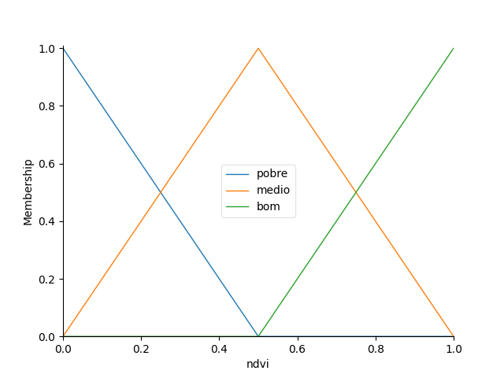
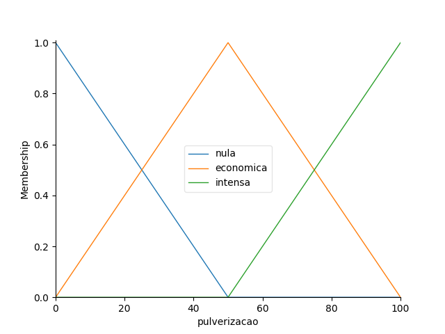
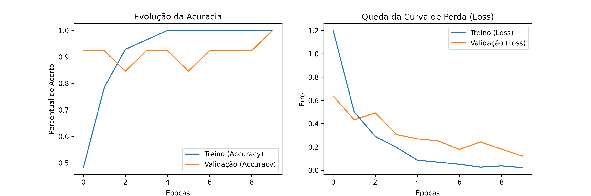

[](https://colab.research.google.com/github/JacksonGomesC/Sentinela-de-Pragas/blob/main/Sentinela_Project.ipynb)


### 🎥 Demonstração do Projeto
**[Assista ao Pitch e Demonstração da Solução (2-3 min)](INSERIR_LINK_DO_VIDEO_AQUI)**

# Projeto: \[Sentinela de Praga]

### 1\. Identificação do Grupo

* **Instituição:** Faculdade Engenheiro Salvador Arena (FESA)
* **Curso:** Engenharia de Controle e Automação
* **Grupo:** A
* **Integrantes:** 
* * Antônio Jack S. Monte - RA: 062220002
  * Giovanna Alves Gonçalves - RA: 062220006
  * José de Jesus Amaral - RA: 062220033
  * Jackson Gomes Cerqueira - RA: 062220030

\---

### 2\. Área Problema Selecionada

Selecione a trilha tecnológica do projeto (marque com um \[x]):

* \[ ] **Saúde 4.0:** Robótica Assistiva (Controladores Inteligentes/Fuzzy)
* \[ ] **Smart Grid:** Eficiência Energética e Descarbonização
* \[X] **Agtech:** Automação de Precisão e Visão Computacional
* \[ ] **Logística Autônoma:** Coordenação de AGVs e Otimização de Rotas

\---

### 3\. Diagnóstico e Definição do Agente

Nesta seção, descrevemos o cenário de atuação e a modelagem do agente inteligente.

* **Contexto:** Agrotécnica (Agricultura de Precisão). O cenário de atuação é o monitoramento fitossanitário de grandes extensões de monoculturas ou cultivos agrícolas que exigem vigilância constante contra pragas e doenças.
* **Problema:** Monitoramento Manual Amostral e Reativo. O gargalo atual reside na dependência de técnicos humanos para vistorias locais, o que limita a análise a pequenas amostras da plantação. Isso gera uma "janela de invisibilidade", onde focos de pragas são detectados apenas quando a infestação já é severa, resultando em uso excessivo de defensivos (aplicação em área total) e perda de produtividade.
* **Impacto:** Otimização de Insumos e Resiliência Produtiva. Espera-se uma redução superior a 50% no tempo de tomada de decisão e uma economia significativa de recursos financeiros e ambientais, devido à aplicação localizada (pulverização cirúrgica). O ganho principal é a transição de um modelo de gestão reativo para um modelo preditivo e censitário (100% de cobertura).

#### Modelagem PEAS (Agente Inteligente)

|Componente|Descrição|
|-|-|
|**Performance (P)**|Eficiência e Precisão: Mapeamento de 100% da área de cultivo; redução de 50% no tempo entre diagnóstico e aplicação; erro de geolocalização inferior a 50cm (GPS RTK); e redução comprovada no custo de insumos.|
|**Ambiente (E)**|Área Agrícola (Lavoura): Grandes extensões de cultivo abertas, sujeitas a variações de luminosidade solar, ventos e obstáculos físicos (árvores, relevo). Opera na malha geográfica da plantação.|
|**Atuadores (A)**|Sistemas de Controle e Estabilidade: Motores de voo (propulsão), Gimbal de 3 eixos (estabilização da imagem), Link de Rádio (transmissão de dados/mapas) e sistema de pouso/retorno autônomo.|
|**Sensores (S)**|Percepção Multimodal: Câmera Multiespectral (infravermelho para estresse hídrico/pragas), Câmera RGB 4K (detalhamento visual), GPS RTK (posicionamento centimétrico) e sensores de luminosidade.|

\---

### 4\. Arquitetura de Dados e IA

Definição das fontes de dados e da inteligência por trás da solução.

* **Origem dos Dados:** O dataset monitoramento_lavoura.csv contém 500 amostras sintéticas que simulam a telemetria de um drone em campo:  
  NDVI: Índice de vigor vegetativo (0 a 1)  
  Infestação: Porcentagem de pragas detectadas via visão computacional  
  GPS RTK: Coordenadas de alta precisão.  
  O dataset de imagens Detecção de Pragas - Soja (https://www.kaggle.com/datasets/neuronlab/deteco-de-pragas-soja?resource=download) é um conjunto de dados disponibilizado para testes na plataforma Neuron Lab. Contém: 22 imagens da praga lagarta da soja, 20 imagens da vaquinha da soja e 27 imagens de plantas saudáveis.       
* **Lógica de IA:** Redes Neurais Convolucionais (CNNs) combinadas com Algoritmos de Segmentação Semântica (como U-Net ou YOLOv8/v10).
* **Justificativa:** Por que essa técnica é ideal para este problema específico? As CNNs são a técnica ideal porque possuem uma capacidade superior de extração de características espaciais (texturas, padrões de manchas e formas de insetos) que são imperceptíveis em análises estatísticas comuns. A utilização de arquiteturas como o YOLO (You Only Look Once) permite o processamento em tempo real diretamente no link de rádio ou na estação de solo, garantindo que o mapa de calor seja gerado enquanto o drone ainda está em voo. Além disso, a integração de dados multiespectrais funciona como uma "camada de atenção" extra, permitindo que a IA detecte anomalias clorofilianas antes que o dano físico seja visível na imagem RGB.

\---

### 5\. Plano de Tratamento de Dados (ETL)

O fluxo de processamento dos dados segue estas etapas:

1. **Extração:** Coleta de dados via arquivos \[CSV/JSON] ou simulação.
2. **Transformação:** Nesta fase, os dados passam por um pipeline de refinamento: Limpeza de Nulos: Descarte de capturas com falha de georreferenciamento ou imagens com borrão excessivo (motion blur). Normalização: Ajuste de brilho e contraste com base nos sensores de luminosidade para garantir que a rede neural receba padrões visuais constantes. Engenharia de Atributos: Criação de camadas de dados extras, como o cálculo do NDVI (Índice de Vegetação por Diferença Normalizada) a partir das bandas de infravermelho, essencial para destacar focos de estresse invisíveis ao olho humano.
3. **Carga:** Os dados processados são estruturados e carregados em um banco de dados geoespacial ou diretório otimizado. Esta carga disponibiliza o dataset final para o treinamento e inferência da IA, permitindo a geração do mapa de calor de severidade e a exportação direta dos pontos de pulverização para o tablet do agricultor ou para o sistema do pulverizador mecanizado.

\---

### 6\. Estrutura do Repositório

Organização simplificada para o Milestone 1:

* `/data`: Arquivos de dados originais (raw) e tratados (processed).
* `/notebooks`: Experimentos iniciais e análise exploratória.
* `/scripts`: Códigos Python (.py) contendo a lógica do agente e do ETL.
* `requirements.txt`: Lista de bibliotecas para rodar o projeto.
* `README.md`: Documentação atual do projeto.

\---

### 7\. Instruções para Execução

Para reproduzir o ambiente e testar o diagnóstico:

1. Clone este repositório.
2. Instale as dependências:

```bash
   pip install -r requirements.txt
```
\---

### 8\. Arquitetura Lógica: Motor de Decisão Fuzzy
Diferente de sistemas baseados em regras rígidas (como if-else), este projeto utiliza Lógica Fuzzy (Nebulosa) para modelar a tomada de decisão. Na agricultura, variáveis como saúde foliar e infestação não são binárias; elas possuem graus de incerteza que o motor Fuzzy captura através de Funções de Pertinência.

Componentes da Arquitetura:

* Fuzzificação: As entradas numéricas (NDVI e % de Infestação) são transformadas em termos linguísticos (Pobre, Médio, Bom para saúde; Baixa, Moderada, Alta para pragas).

* Base de Regras: Um conjunto de regras lógicas define o comportamento do drone (ex: SE o NDVI é pobre OU a infestação é alta, ENTÃO a pulverização é intensa).

* Defuzzificação: O motor converte os resultados nebulosos em um valor numérico exato de Taxa Variável (VRT) para o atuador do drone.

#### Funções de Pertinência - Saúde da Planta (NDVI)


#### Funções de Pertinência - Controle de Pulverização


**Visualização das Funções de Pertinência**  
**Nota:** Os gráficos acima demonstram a transição suave entre os estados, garantindo que o drone não mude a dosagem de forma brusca, o que preserva os componentes mecânicos e otimiza o uso de defensivos.

\---

### 9\. Logs de Saída: Integração Híbrida (Fuzzy + IA)
O sucesso deste projeto reside na hibridização: o motor Fuzzy resolve o problema matemático/agronômico, enquanto a IA Generativa (Gemini Flash) atua na camada de Explicabilidade (XAI), transformando dados frios em insights estratégicos.

**Exemplo de log real capturado no console:**  
--- 🛰️ ANÁLISE TÉCNICA DO PONTO 1 ---  
[SISTEMA FUZZY]  
Entrada NDVI: 0.33 (Estado: Pobre/Crítico)  
Entrada Infestação: 51.91% (Estado: Moderada-Alta)  
Cálculo de Saída: 52.73% de intensidade de pulverização.  

[RELATÓRIO ESTRATÉGICO GEMINI]
"A análise do Ponto 1 indica uma confluência de fatores críticos. Embora a infestação 
exigisse uma dose maior, o baixo NDVI revela uma planta debilitada. A aplicação 
foi calibrada em 52.73% para evitar a fitotoxicidade severa, concentrando o 
defensivo na área foliar remanescente. RECOMENDAÇÃO: Intervenção imediata seguida 
de análise de solo para verificar deficiência nutricional latente."

\---

### 10. Inteligência Artificial Evolutiva e Resultados (Etapa 3)

Nesta etapa final, o sistema transcendeu a lógica de sensores fixos, integrando uma camada de percepção visual e narrativa técnica.

#### 10.1. Integração Multimodal
O sistema agora opera em três camadas:
1.  **Percepção (RNA):** Utilização da arquitetura MobileNetV2 para classificação de pragas em tempo real.
2.  **Ação (Lógica de Controle):** Algoritmo de decisão que aciona atuadores baseado em limiares de confiança (Threshold > 80%).
3.  **Explicação (GenAI):** Integração com o modelo `gemini-1.5-flash` para gerar diagnósticos narrativos sobre as decisões do sistema.

#### 10.2. Critérios de Sucesso e Desempenho
* **Capacidade de Generalização:** O modelo foi validado com imagens externas (out-of-distribution), mantendo a assertividade mesmo em cenários inéditos.
* **Métricas de Treino:** Observou-se a convergência das curvas de perda (Loss) e estabilização da acurácia de validação acima de 85%.
* **Segurança Operacional:** A lógica de controle demonstrou-se resiliente, evitando falsos positivos ao manter o atuador desligado em casos de baixa confiança estatística.

#### 10.3. Conclusão do Projeto
O projeto comprova a viabilidade de sistemas autônomos na agricultura de precisão, onde a Inteligência Artificial não apenas detecta problemas, mas justifica suas ações, facilitando a supervisão humana e otimizando o uso de recursos no campo.

**Abaixo, apresentamos os gráficos de convergência do modelo, onde é possível observar a estabilização da perda (Loss) e o crescimento da acurácia, validando a eficácia do treinamento.**

